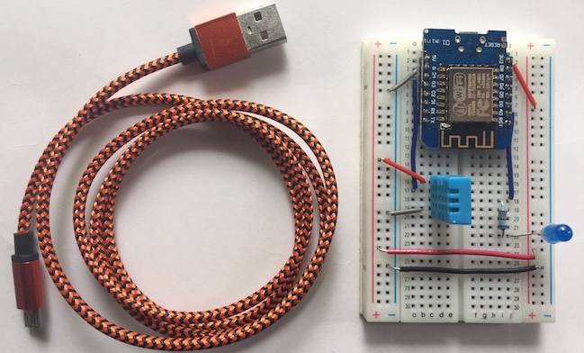

#### Update 5/16
Some additions / changes to the setup instructions below
* Instead of Crouton we will use [mqtt-spy](https://github.com/eclipse/paho.mqtt-spy/wiki/Downloads) for visualization. Once you have mosquitto setup (see below) you can test out mqtt-spy following the [getting started](https://github.com/eclipse/paho.mqtt-spy/wiki/GettingStarted) instructions. Version 0.5.3 of mqtt-spy is available in this repo under the "tools" directory

* We will be going over TLS/SSL which involves generating and using certificates and key files. While not mandatory, if you want to generate these files during the tutorial you can the shell scripts under "tools" in this repo for Linux and MacOS and refer to "Linux-MacOS_SSL_Client_Certs_RockingD_Labs.pdf". For Windows, install openssl and follow the instructions in the "Windows Mosquitto SSL Configuration.pdf" under tools from steves-internet-guide.  Micropython doesn't presently support SSL certificate verification, so we will just be using this on localhost; it's not a big deal if you can't get this to work.

* I've added some code and config files to this repo you will want for the class. Ill be making additional updates on Wednesday (5/17) and will email the class when the final materials are ready.

## PyCon 2017 IoT Tutorial
##### The Internet of Things with MicroPython and Friends
Welcome!
This repo is mainly here to provide info on how to get setup for the tutorial. I might add some more interesting files later on, Ill email the class if I do.

You will be learning to program in micropython using the ESP8266 microcontroller with the WeMos D1 mini development board. Phew! Basically the WeMos is the blue part of the picture below and the ESP is the silver & black part with the weird wave form looking thing (its an antenna).  The WeMos gives us some nice extras, like a reset button and a mini USB connection to power and communicate with the board. When I talk about 'the board' I'm referring to the WeMos.

 We will be creating a Thing to connect to the Internet that monitors temperature and humidity (the light blue boxy thing beneath the WeMos). There will be blinking LEDs, sensing and communicating, and discussions of basic security for IoT networks. There will also be snacks, I'm told.

### Setup Instructions
Here are some instructions to help you get setup for the tutorial. If you run into problems please file an issue / check existing issues. Failing that you can contact me through the PyCon email interface.

 The equipment you will need:
  * A computer with wifi and an available USB (3) port. We will use the USB port to power the WeMos. You can also use a USB charging brick instead of a USB port.

  * A web browser. Chrome preferred, Firefox or Windows Edge will also work. The webrepl client behaves a little finicky depending on browser, particularly for copy and paste. These 3 worked well.

#### Programs to install:  
I recommend you create a directory i.e. pycon2017 to keep track of the various collateral needed.

* Clone the [webrepl client](https://github.com/micropython/webrepl). This is a web interface we will use to program the ESP8266.

`cd pycon2017`  
`git clone https://github.com/micropython/webrepl.git`  

* ~~Install [Crouton](https://github.com/edfungus/Crouton).~~ This is replaced with mqtt-spy as indicated above.

* Install the Mosquitto MQTT broker
We will be using Mosquitto to transfer messages using the MQTT protocol.  
  - MacOS: `brew install mosquitto`
  - Windows: Download the [Mosquitto Install Files]( http://www.steves-internet-guide.com/downloads/) and place in C:\Program Files (x86)\mosquitto  
  - Linux: You probably know better than me, check the [Mosquitto website]( https://mosquitto.org/download/)

[This tutorial](https://www.baldengineer.com/mqtt-tutorial.html) has some helpful tips on installing and testing Mosquitto, such as:  
1. Start the mosquitto service  
  * MacOS: `brew services start mosquitto`
  * Windows: cd to the directory where you installed mosquitto and type `mosquitto`  

2. In another terminal/command window, setup a test subscriber. Remember you need to be in the mosquitto directory on Windows for this to work:  
`mosquitto_sub -h 127.0.0.1 -i testSub -t debug`

3. In another terminal/command window, setup a test publisher and send some messages. You should see these show up in your subscriber terminal  
`mosquitto_pub -h 127.0.0.1 -i testPublish -t debug -m 'Hello World'`  

* Optionally, install the driver for the ESP8266. We won't be using this to connect to the ESP, but if you wanted to have a backup option or are just curious you can add this driver. I've verified that the firmware we are using (see firmware/ in this repo) works with the Mac driver
    - [MacOS](https://github.com/adrianmihalko/ch340g-ch34g-ch34x-mac-os-x-driver)  
    - [Windows](http://www.wch.cn/download/CH341SER_ZIP.html)
    - [Linux](http://www.wch.cn/download/CH341SER_LINUX_ZIP.html)
